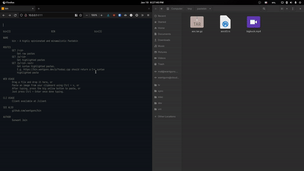

# Bin 
A minimal pastebin which also accepts binary files like Images, PDFs and ships
multiple clients. 

It does not require you to host a SQL server and everything is self-contained in
a statically linked binary (the docker image runs on scratch !), which makes it
extremely easy to deploy.

Try it out on: https://basedbin.fly.dev

## Clients

### Web

You can paste

- Normal Text

- Paste Images from clipboard:  


- Files by drag and drop:  


### CLI

[](https://asciinema.org/a/khcEtveMAbjqJccySdmWuPe1l)

#### Installation

Get the client from [this repository](contrib/cli/client) or from my deployed paste:

```bash
curl -o pst https://bin.wantguns.dev/client
chmod +x pst
```

or manually copy the following at a file in your path.

```bash
#!/bin/bash

# Change the url accordingly
URL="https://basedbin.fly.dev"

FILEPATH="$1"
FILENAME=$(basename -- "$FILEPATH")
EXTENSION="${FILENAME##*.}"

RESPONSE=$(curl --data-binary @${FILEPATH:-/dev/stdin} --url $URL)
PASTELINK="$URL$RESPONSE"

[ -z "$EXTENSION" ] && \
    echo "$PASTELINK" || \
    echo "$PASTELINK.$EXTENSION"
```

#### Usage

It just works.

```bash
$ pst somefile.txt
$ cat someimage.png | pst
```

### (Neo)Vim

#### Installation

1. Install the CLI client
2. Append this to your init.vim / vimrc

```vim
nnoremap <leader>p :!pst %<CR>
```
#### Usage

Use `<leader> + p` paste.


## Server Deployment

Currently, builds for the following target triples are shipped:
- x86_64-unknown-linux-gnu (amd64)
- aarch64-unknown-linux-gnu (arm64)

The builds shipped are statically linked, so you don't even need a libc to run the binary !  
The docker manifest labelled
[`wantguns/bin:latest`](https://hub.docker.com/layers/wantguns/bin/latest/images/sha256-34c19b59d098bd1420fc48f6b1f01dc250d3d8787a3786f5425efb4e74cc17f2?context=repo)
includes the images for both amd64 and arm64 images.

### Docker

```bash
$ docker run -p 6162:6162 wantguns/bin
```

### Docker Compose

```yaml
version: '3.3'
services:
  pastebin:
    image: wantguns/bin
    container_name: pastebin
    ports:
      - 127.0.0.1:6163:6163
    environment:
      - BIN_PORT=6163 # Defaults to 6162
      - BIN_LIMITS={form="16 MiB"}
    volumes:
      - ./upload:/upload  # upload folder will have your pastes
```

### Manual

- Grab a copy of the binary from GH releases   
OR
- Build on your own:
```bash
# A statically linked build
$ cargo build --release
```

- Execute the binary as is, no extra shenanigans needed:
```bash
$ ./bin
```

#### Usage

```txt
USAGE:
    bin [OPTIONS]

OPTIONS:
    -a, --address <ADDRESS>
            Address on which the webserver runs [default: 0.0.0.0]

    -b, --binary-upload-limit <BINARY_UPLOAD_LIMIT>
            Binary uploads file size limit (in MiB) [default: 100]

    -h, --help
            Print help information

    -p, --port <PORT>
            Port on which the webserver runs [default: 6162]

    -u, --upload <UPLOAD>
            Path to the uploads folder [default: ./upload]

    -V, --version
            Print version information
```

#### Configuration

This pastebin utilizes a custom configuration provider from Rocket. Apart from the essential arguments, you can also use environment variables, which have the highest preference in order.

Everything from the [official Rocket doc](https://rocket.rs/v0.5-rc/guide/configuration/#overview) is supported, just that you have to prefix the env variable with "BIN_":
```txt
BIN_PORT=6163
BIN_ADDRESS=0.0.0.0
BIN_LIMITS={form="16 MiB"}
BIN_WORKERS=8
BIN_IDENT=false
...
```


## API

`GET /<id>`  
  Get raw pastes

`GET /p/<id>`  
  Get highlighted pastes 

`GET /p/<id>.<ext> `  

  Get syntax highlighted pastes.  
  E.g. https://basedbin.fly.dev/p/foobaz.cpp should return a C++ syntax
  highlighted paste

`POST /`  
  Post binary data

## Design Decisions

This pastebin: 

- does not use a database. It lacks non-essential features like password-protection / automatic deletion as a result of which, it can do completely fine with flat filesystems. As an upside (opinionated), it makes deploying it easier.
- uses server sided highlighting, which ensures that everything stays light and snappy at the client side.
- uses very minimal frontend because a pastebin does not need it. It focuses (or atleast tries to) on getting things done in minimum amount of clicks.

